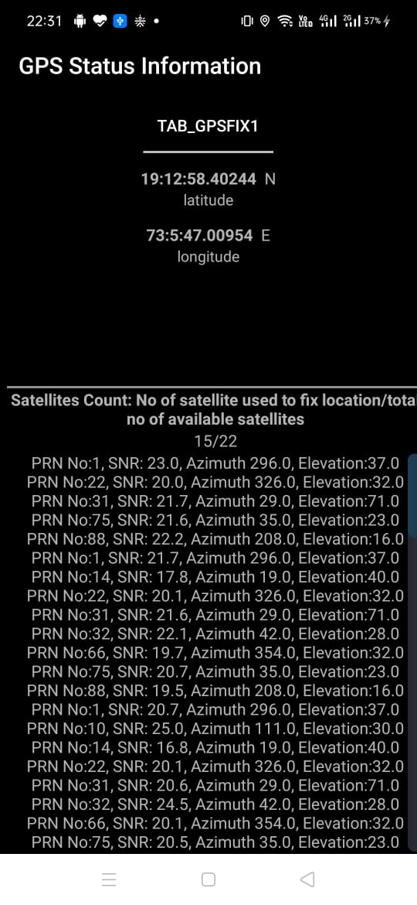

# gps_final_satellite_tracker
* Implemented module that shows no of satellites relatively to current position
* Display both no of satellites used to fix location and total no of available satellites with respect to current Gps Coordinates
* GPS Coordinated displayed on screen
* getPrn()  method returns pseudo random number for satellite
* getAzimuth() method  returns azimuth of the satellite in degrees 
* getElevation() method returns  elevation of the satellite in degrees
* getSnr() method returns signal to noise ratio
* usedInFix() method returns Returns true if the satellite was used by the GPS engine when calculating the most recent GPS fix

